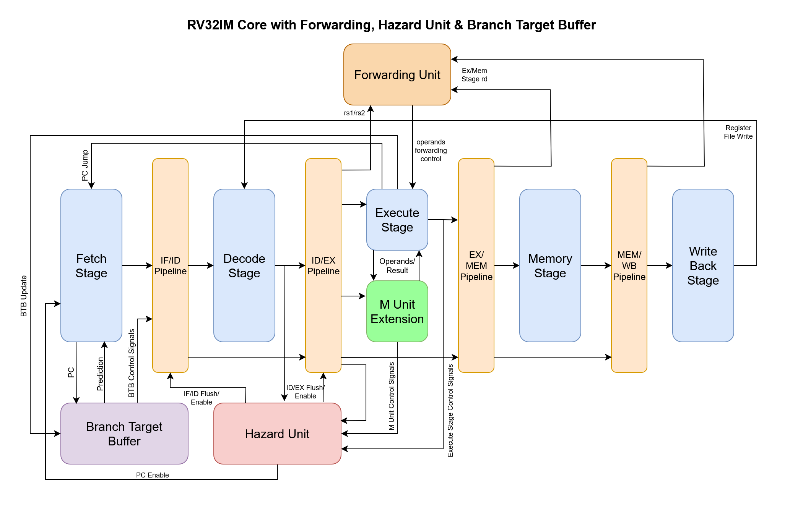
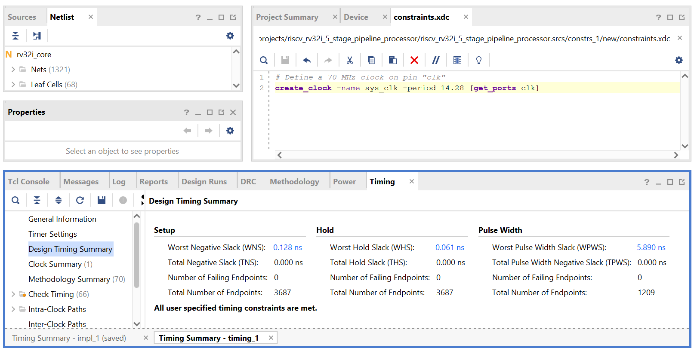
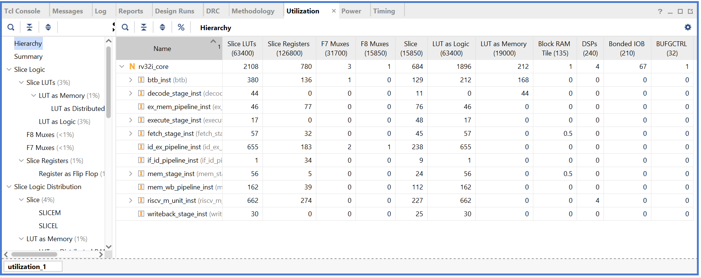
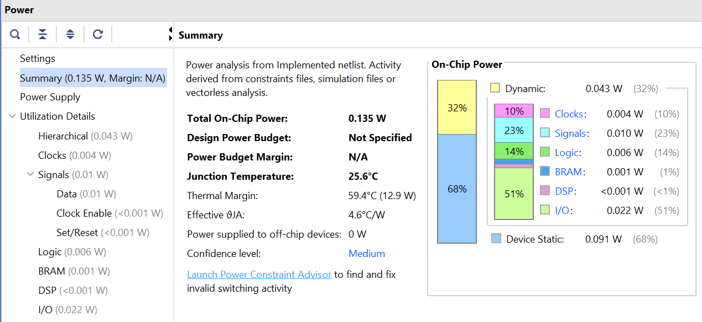

# RV32IM 5-Stage Pipelined Processor

This repository contains the implementation and verification of a RISC-V RV32IM processor with a classic 5-stage pipeline.
The design supports the base **RV32I** instruction set along with **M-extension** (multiplication and division). It also has a hazard unit for flushing/stalling the pipeline, a forwarding unit to prevent data hazards, and a branch target buffer for branch prediction.

---

## 📑 Table of Contents

* [Block Diagram](#-block-diagram)
* [Repository Structure](#-repository-structure)
* [Pipeline Stages](#-pipeline-stages)
* [Supporting Modules](#-supporting-modules)
* [Timing](#-timing)
* [FPGA Resource Utilization](#-fpga-resource-utilization)
* [Performance Improvements](#-performance-improvements)
  * [M-Unit vs Shift-Add Multiply](#m-unit-vs-shift-add-multiply)
  * [BTB Speedup](#btb-speedup)
* [How to Run](#-how-to-run)
* [Future Work](#-future-work)
* [License](#-license)

---

## 📊 Block Diagram



---

## 📂 Repository Structure

```
src/                 
  ├── fetch_stage/
  ├── decode_stage/
  ├── execute_stage/
  ├── mem_stage/
  ├── writeback_stage/ 
  ├── pipeline_registers/
  ├── branch_target_buffer/
  ├── m_unit_extension/ 
  ├── forwarding_unit.v
  ├── hazard_unit.v
  ├── rv32i_core.v
  └── defines.vh
tb/                   Testbenches
programs/             Sample RISC-V programs
imgs/                 Block diagrams
LICENSE
README.md             Main documentation
```

---

## 🔄 Pipeline Stages

Each stage has its own folder with detailed documentation:

* [Instruction Fetch (IF)](src/fetch_stage/README.md)
* [Instruction Decode (ID)](src/decode_stage/README.md)
* [Execute (EX)](src/execute_stage/README.md)
* [Memory Access (MEM)](src/mem_stage/README.md)
* [Write Back (WB)](src/writeback_stage/README.md)

### Special Notes

* In **IF/ID**, no extra instruction register is needed (instruction memory has 1-cycle latency).
* In **MEM/EX**, no pipeline register for memory result is required (synchronous read provides natural delay).
* **IF/ID** and **ID/EX** pipeline registers support **flush** and **enable** signals from the hazard unit. On flush, all signals turn into a NOP.

---

## 🧩 Supporting Modules

* [Branch Target Buffer (BTB)](src/branch_target_buffer/README.md) – simple branch predictor with update mechanism.
* [M Unit](src/m_unit_extension/README.md) – RV32M extension, hardware multiplier/divider.
* [Forwarding Unit](src/README.md) – resolves data hazards by forwarding from MEM/WB.
* [Hazard Unit](src/README.md) – detects load-use hazards, handles pipeline stalls and flushes.

---

## ⚡ Performance Improvements

### M-Unit vs Shift-Add Multiply

* Traditional **shift-add multiply/shift-sub divide** requires **32 iterations** for a 32-bit multiply/divide and each iteration can have 4-5 instruction each instruction taking 5 cycles. This totals around **600-700 cycles**.
* The dedicated **M-unit** executes multiplication in **1 cycles** and for division a maximum of **27 cycle**.
* This reduces CPI drastically for multiplication-heavy programs (e.g., matrix multiply).

### BTB Speedup

* Without BTB: Every taken branch incurs a **2-cycle penalty**.
* With BTB: Correctly predicted branches avoid stalls, improving performance by **\~15–25%** on loop-heavy benchmarks.

---

## ⏱ Timing

* Maximum clock frequency achieved: **70 MHz** on Nexys A7 (XC7A100T).
* Critical path: Execute stage (ALU + forwarding logic + PC Jump Address).



---

## 📊 FPGA Resource Utilization

* The results are Post-Implementation results for Nexys A7 (XC7A100T) at 70MHz.

| Resource        | Utilization |
| --------------- | ----------- |
| Slice LUTs      | 596         |
| Slice Registers | 203         |
| BRAM            | 1           |
| DSP Blocks      | 4           |



---

### ⚡ Power Consumption

* **Dynamic Power:** 0.043 W (due to switching activity during operation)
* **Static Power:** 0.091 W (leakage and idle power)
* **Total Estimated Power:** 0.134 W

💡 *These numbers come from Vivado’s post-implementation power report at 70 MHz.*



---

## 📜 How to Run

1. Clone the repo:

   ```bash
   git clone https://github.com/TalhaIsrar/RISCV-RV32IM-5-Stage-Pipelined-Processor
   ```
2. Open **ModelSim** or **Vivado** project and add files from `src/` and `tb/`.
3. Compile RISC-V test programs from `programs/` and load them into instruction memory.

---

## 📌 Future Work

* Support for CSR instructions
* More advanced branch predictors (2-bit, gshare)
* Memory-mapped I/O support
* UVM-based verification

---


## 🔗 References

* [RISC-V ISA Manual](https://riscv.org/technical/specifications/)
* \[Computer Organization and Design RISC-V Edition – Patterson & Hennessy]

---

## 📄 License

This project is released under the MIT License. See the [LICENSE](LICENSE) file for details.

---

## 🤝 Contributions

Contributions, suggestions, and issue reports are welcome! Feel free to fork and open pull requests.

---

*Created by Talha Israr*  
