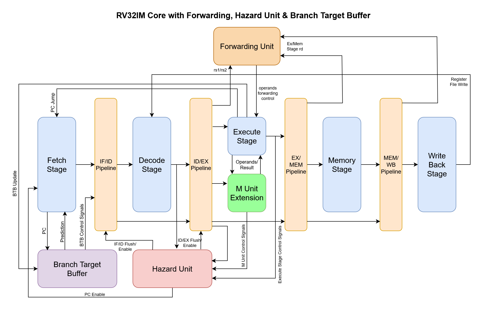

# RV32IM Core – 5-Stage Pipelined Processor

This project implements a **5-stage pipelined RISC-V RV32IM processor** in Verilog. It follows the classical pipeline structure (IF → ID → EX → MEM → WB) with additional modules for branch prediction, hazard detection, forwarding, and multiplication/division support.

---

## Block Diagram

---

## Processor Pipeline Overview

### Pipeline Stages

1. **Instruction Fetch (IF)**

   * Fetches instruction from instruction memory.
   * Integrates with **Branch Target Buffer (BTB)** for branch prediction.
   * Next PC logic selects between sequential, jump, or predicted target.

2. **Instruction Decode (ID)**

   * Decodes instruction fields (opcode, funct3, funct7).
   * Reads register file operands.
   * Immediate generator produces required constants.

3. **Execute (EX)**

   * Performs ALU operations (arithmetic, logical, shifts, branch compare).
   * Integrates with **M-unit** for multiplication/division instructions.
   * Calculates jump/branch target addresses.
   * Updates BTB if misprediction detected.

4. **Memory Access (MEM)**

   * Handles data memory reads/writes.
   * Load/store alignment and size supported.

5. **Write Back (WB)**

   * Writes either memory read data or ALU/M-unit result back to the register file.

---

## Key Supporting Units

### 1. Branch Target Buffer (BTB)

* Stores branch targets and prediction bits.
* 8 - 2 way set associative buffer
* Supplies predicted PC for branches in the IF stage.
* Updated in EX stage on branch/jump resolution.
* Helps reduce branch penalty to 1 cycle.

---

### 2. Forwarding Unit

* Resolves **data hazards** without stalling when possible.
* Selects between:

  * Register file operands (default)
  * MEM stage result
  * WB stage result
* Provides `operand_a_cntl` and `operand_b_cntl` control signals to the EX stage.

---

### 3. Hazard Unit

* Handles pipeline **stalls and flushes**:

  * **Load-use hazard**: Inserts 1-cycle stall when an instruction depends on a load in EX.
  * **Branch/jump misprediction**: Flushes IF/ID and ID/EX stages.
  * **Invalid instructions**: Flushed before execution.
* Controls pipeline register enable/flush signals (`if_id_pipeline_flush`, `id_ex_pipeline_flush`, etc.) and `pc_en`.

---

### 4. M-unit (Multiply/Divide Unit)

* Executes RISC-V **M extension** instructions.
* Operates alongside ALU in EX stage.
* Provides result once ready (`m_unit_ready`).
* Hazard unit stalls pipeline when M-unit is busy.

---

## Pipeline Registers

Each pipeline stage is separated by registers for timing and hazard management:

* **IF/ID**: Holds instruction + PC. *No separate instruction register needed since instruction memory already has 1-cycle latency.*
* **ID/EX**: Holds decoded operands, immediates, and control signals.
* **EX/MEM**: Holds ALU/M-unit results and operands for memory stage. *No separate mem_result register since data memory already introduces 1-cycle latency.*
* **MEM/WB**: Holds data read from memory and ALU result for write-back.

Both **IF/ID** and **ID/EX** pipeline registers support **flush and enable signals** from the hazard unit. On a flush, signals are set to correspond to a **NOP instruction**.

---

## Summary

This RV32I processor integrates:

* **5-stage pipelined datapath**
* **Hazard detection and forwarding logic** for smooth execution
* **BTB-based branch prediction** for reduced branch penalty
* **M extension support** for multiplication/division

The modular design makes it easy to extend with caches, pipeline optimizations, or additional ISA extensions.

---

*Created by Talha Israr*
