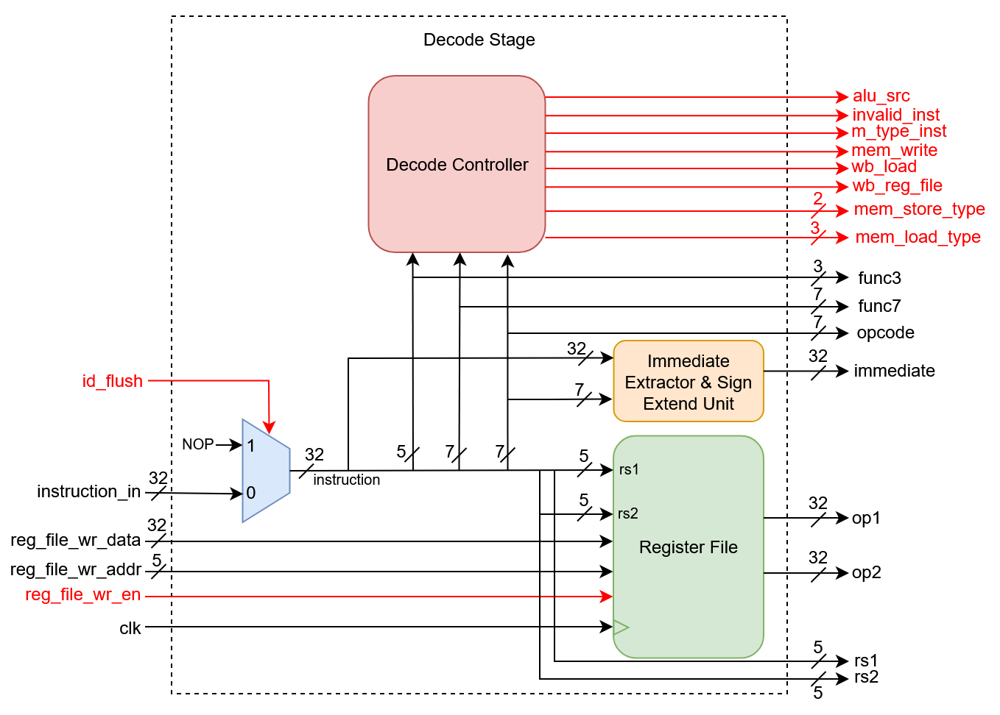
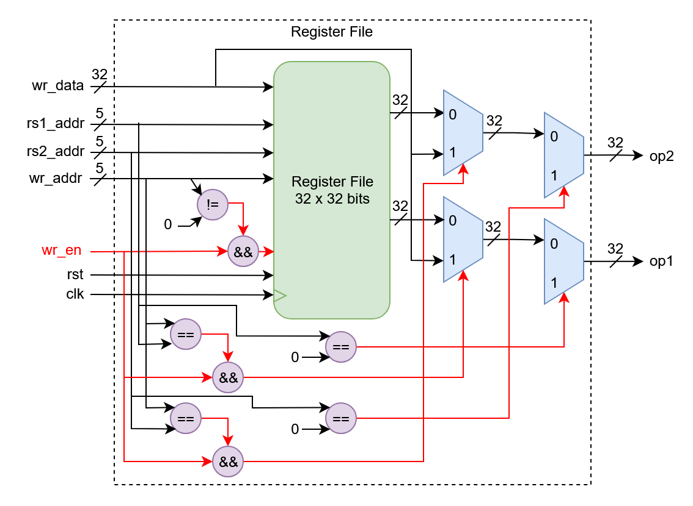

# Decode Stage Module

This folder contains the implementation of the **Instruction Decode (ID) stage** for the RV32IM 5-stage pipelined processor.
The ID stage is responsible for **decoding instructions**, **generating control signals**, **reading operands from the register file**, and **calculating immediates**.

## 📂 Folder Structure

* **decode_stage.v**
  Top-level RTL Verilog file implementing the decode stage.

* **decode_controller.v**
  Control logic for generating ALU, memory, and writeback signals based on the instruction.

* **register_file.v**
  Synchronous 32x32 register file with writeback forwarding and hardwired x0.

* **README.md**
  This documentation file.

## 🚀 Features

* Decodes RISC-V instructions (R/I/S/B/U/J types) and extracts opcode, func3, func7, rs1, rs2, rd.
* Computes **immediate values** for different instruction formats.
* Generates control signals:

  * `alu_src` → selects ALU operand
  * `mem_write` / `mem_load_type` / `mem_store_type` → memory access
  * `wb_load` / `wb_reg_file` → writeback control
  * `invalid_inst` → flags unrecognized instructions
  * `m_type_inst` → identifies multiplication/division instructions
* Provides **operand forwarding** from writeback stage to prevent RAW hazards.
* x0 is **hardwired to 0**.

## 📜 How It Works

### Ports

| Name               | Direction | Width | Description                                    |
| ------------------ | --------- | ----- | ---------------------------------------------- |
| `clk`              | input     | 1     | Clock signal                                   |
| `rst`              | input     | 1     | Reset signal                                   |
| `id_flush`         | input     | 1     | Flush the instruction (NOP)                    |
| `instruction_in`   | input     | 32    | Instruction from fetch stage                   |
| `reg_file_wr_en`   | input     | 1     | Enable writeback to register file              |
| `reg_file_wr_addr` | input     | 5     | Register address to write back                 |
| `reg_file_wr_data` | input     | 32    | Data to write back                             |
| `op1`              | output    | 32    | Operand 1 from register file                   |
| `op2`              | output    | 32    | Operand 2 from register file                   |
| `rs1`              | output    | 5     | Source register 1                              |
| `rs2`              | output    | 5     | Source register 2                              |
| `rd`               | output    | 5     | Destination register                           |
| `immediate`        | output    | 32    | Sign-extended immediate                        |
| `opcode`           | output    | 7     | Instruction opcode                             |
| `func3`            | output    | 3     | Instruction func3 field                        |
| `func7`            | output    | 7     | Instruction func7 field                        |
| `alu_src`          | output    | 1     | Select immediate or register as ALU operand    |
| `mem_write`        | output    | 1     | Memory write enable                            |
| `mem_load_type`    | output    | 3     | Load type (LB, LH, LW, LBU, LHU)               |
| `mem_store_type`   | output    | 2     | Store type (SB, SH, SW)                        |
| `wb_load`          | output    | 1     | Enable writeback from memory                   |
| `wb_reg_file`      | output    | 1     | Enable writeback to register file              |
| `invalid_inst`     | output    | 1     | Flags unrecognized instruction                 |
| `m_type_inst`      | output    | 1     | High if instruction is multiplication/division |

### Behavior

* **Immediate Generator:** Creates sign-extended immediate values for different instruction types (I/S/B/U/J).
* **Controller:** Produces control signals based on opcode, func3, func7.
* **Register File:** Reads operands (`op1`, `op2`) and supports writeback forwarding.
* **Instruction Flush:** Converts instruction to NOP if pipeline flush is requested.

```verilog
assign instruction = id_flush ? 32'h00000013 : instruction_in;
```

## 📊 Block Diagram



* **Decode Controller:** Generates control signals for ALU, memory, and writeback.
* **Immediate Generator:** Produces immediate values based on instruction type.
* **Register File:** Provides operands to the execute stage and supports writeback forwarding.



---

## 📌 Notes

* Flush logic converts instructions to NOP to prevent hazards.
* Compatible with 5-stage RV32IM pipeline design.

---


*Created by Talha Israr*
