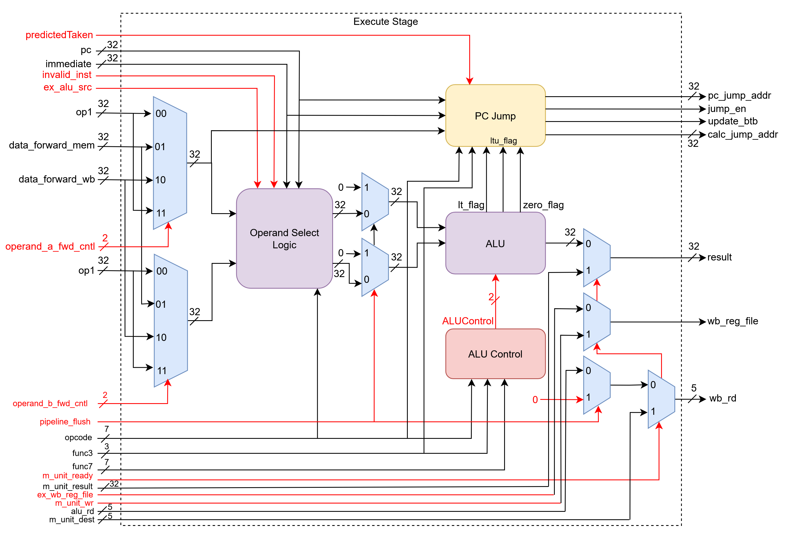
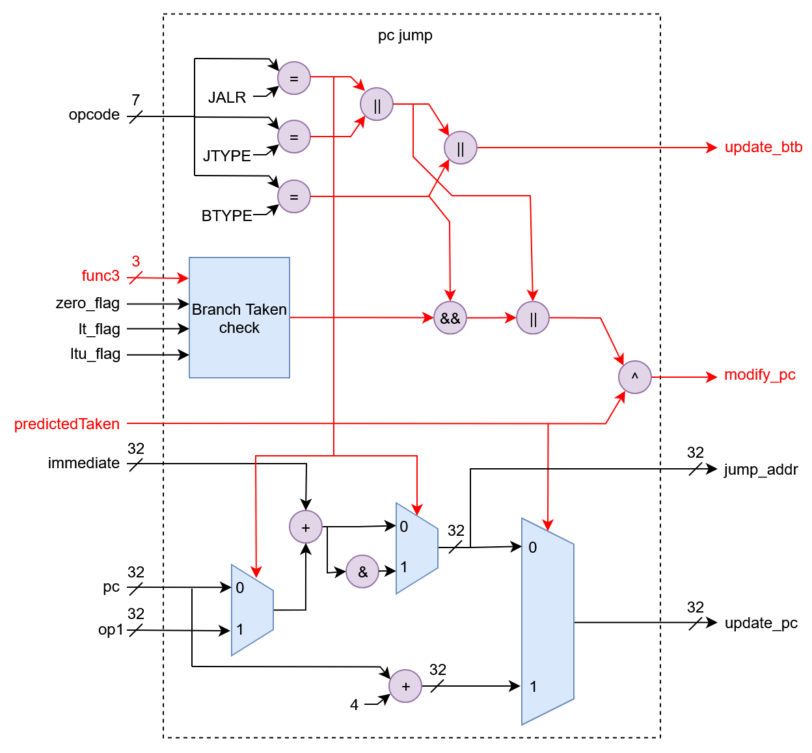

# Execute Stage – RV32IM 5-Stage Processor

This folder contains the implementation of the **Execute (EX) stage** for the RV32IM 5-stage pipelined processor.
The EX stage performs **arithmetic, logical, and branch calculations**, selects ALU operands, handles forwarding, and calculates jump/branch target addresses.

---

## 📂 Folder Structure

* **execute_stage.v** – Top-level EX stage connecting ALU, ALU controller, forwarding logic, and PC/jump calculation.
* **alu.v** – Arithmetic Logic Unit (ALU) performing signed/unsigned operations, comparisons, and shifts.
* **alu_control.v** – Generates ALU control signals based on opcode, func3, and func7 fields.
* **pc_jump.v** – Computes branch and jump target addresses, evaluates branch conditions, and signals BTB updates.
* **README.md** – This documentation file.
---

## 🚀 Features

* **Operand forwarding** from MEM/WB stages to prevent data hazards
* **ALU operations**: add, sub, AND, OR, XOR, shifts, SLT/SLTU
* **Branch/jump calculation** with support for predictedTaken signals
* **Flush support**: on pipeline flush, ALU operands are forced to zero, preventing invalid computation
* **M-unit integration**: outputs from multiplication/division unit are passed when they are ready
* **Write-back control**: selects correct destination register and enables register file write

---

## 📌 Key Design Points

1. **Operand Forwarding**

   * Operand A and B can be forwarded from **EX/MEM** or **MEM/WB** pipeline stages.
   * Prevents data hazards without stalling the pipeline.
   * Forwarding control signals `operand_a_forward_cntl` and `operand_b_forward_cntl` determine the source of operands for the ALU.

2. **ALU Operand Selection**

   * Operand 1 (`op1_alu`) and Operand 2 (`op2_alu`) are selected based on instruction type:

     * I-type: immediate used for Operand 2
     * JAL/JALR: Operand 1 = PC, Operand 2 = 4
     * U-type/AUIPC: Operand 1 = 0/PC, Operand 2 = immediate
     * Other instructions: Operand 1/2 taken from register file or forwarded data
   * On a **pipeline flush**, operands are set to 0 to avoid invalid operations.

3. **Branch & Jump Handling**

   * Branch and jump addresses are calculated in EX stage using `pc_jump` module.
   * Conditional branches use ALU flags (`lt_flag`, `ltu_flag`, `zero_flag`) to determine if the branch is taken.
   * Jumps and branches generate `jump_en` and `update_btb` signals to guide the fetch stage and update the Branch Target Buffer.

4. **M-unit Integration**

   * When a multiplication/division (M-unit) result is ready, it overrides the ALU output.
   * Write-back signals (`wb_reg_file`, `wb_rd`) are updated to reflect M-unit output.

5. **Write-back Selection**

   * `wb_reg_file` determines if the destination register should be written.
   * `wb_rd` indicates the target register.
   * Ensures correct values are forwarded or written back even during flushes or M-unit results.

---

## 📊 Signal Overview (Grouped)

### 1. **Program Counter & Instruction Info**

| Signal                     | Width | Description                                 |
| -------------------------- | ----- | ------------------------------------------- |
| `pc`                       | 32    | Current program counter                     |
| `opcode`, `func3`, `func7` | 7/3/7 | Instruction fields for ALU and branch logic |
| `immediate`                | 32    | Immediate extracted from instruction        |
| `predictedTaken`           | 1     | Branch prediction from BTB                  |

### 2. **Operands & Forwarding**

| Signal                                             | Width | Description                                |
| -------------------------------------------------- | ----- | ------------------------------------------ |
| `op1`, `op2`                                       | 32    | Register file operands                     |
| `operand_a_forward_cntl`, `operand_b_forward_cntl` | 2     | Forwarding control (00=reg, 01=WB, 10=MEM) |
| `data_forward_mem`, `data_forward_wb`              | 32    | Forwarded data values                      |

### 3. **Execution Control**

| Signal           | Width | Description                               |
| ---------------- | ----- | ----------------------------------------- |
| `ex_alu_src`     | 1     | ALU operand 2 select (immediate/register) |
| `invalid_inst`   | 1     | High if instruction is invalid            |
| `pipeline_flush` | 1     | Flush stage (NOP)                         |

### 4. **M-unit Integration**

| Signal          | Width | Description                            |
| --------------- | ----- | -------------------------------------- |
| `m_unit_result` | 32    | Multiplication/division result         |
| `m_unit_ready`  | 1     | Indicates M-unit result is valid       |
| `m_unit_wr`     | 1     | Write-back enable for M-unit           |
| `m_unit_dest`   | 5     | Destination register for M-unit result |

### 5. **Write-back**

| Signal           | Width | Description                 |
| ---------------- | ----- | --------------------------- |
| `alu_rd`         | 5     | ALU destination register    |
| `ex_wb_reg_file` | 1     | Write enable for ALU result |

---

### Outputs

| Signal Group       | Signals                                                   | Description                                                           |
| ------------------ | --------------------------------------------------------- | --------------------------------------------------------------------- |
| **ALU & Operands** | `result`, `op1_selected`, `op2_selected`                  | Execution result (ALU or M-unit) and selected operands for next stage |
| **Branch/Jump**    | `pc_jump_addr`, `calc_jump_addr`, `jump_en`, `update_btb` | Next PC, calculated jump target, jump enable, and BTB update signal   |
| **Write-back**     | `wb_rd`, `wb_reg_file`                                    | Destination register and write-back enable for register file          |

---

## 📊 Block Diagram

* Operand Muxes select between register file and forwarded values.
* ALU performs computations for arithmetic, logical, and comparison operations.
* M-unit result mux ensures multiplication/division results override ALU output.
* PC Jump Calculator evaluates branch/jump conditions and generates updated PC and BTB signals.

---

*Created by Talha Israr*
