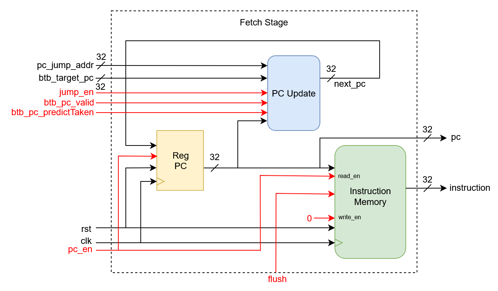

# Fetch Stage Module

This folder contains the implementation of the **Instruction Fetch (IF) stage** for the RV32IM 5-stage pipelined processor.
The IF stage is responsible for **fetching instructions from memory**, managing the **program counter (PC)**, and integrating **branch target prediction** from the BTB.

## 📂 Folder Structure

* **fetch_stage.v**
  Top-level RTL Verilog file implementing the fetch stage.

* **instruction_mem.v**
  Synchronous instruction memory module for storing the program.

* **pc.v**
  PC register module with enable and reset.

* **pc_update.v**
  Logic to select the next PC based on jumps, branches, and BTB predictions.

* **README.md**
  This documentation file.

## 🚀 Features

* Fetches instructions from **instruction memory**.
* Maintains the **program counter** (PC) with enable and reset.
* Supports **branch prediction** using BTB.
* Handles **pipeline flushes** for mispredicted branches.
* Modular design to separate **PC register**, **PC update logic**, and **instruction memory**.

## 📜 How It Works

### Ports

| Name                  | Direction | Width | Description                                        |
| --------------------- | --------- | ----- | -------------------------------------------------- |
| `clk`                 | input     | 1     | Clock signal                                       |
| `rst`                 | input     | 1     | Reset signal                                       |
| `pc_en`               | input     | 1     | Enable PC update                                   |
| `flush`               | input     | 1     | Flush current instruction (NOP)                    |
| `pc_jump_addr`        | input     | 32    | Target PC for jumps/branches                       |
| `jump_en`             | input     | 1     | High if current instruction is a jump/branch taken |
| `btb_target_pc`       | input     | 32    | PC predicted by BTB                                |
| `btb_pc_valid`        | input     | 1     | High if BTB prediction is valid                    |
| `btb_pc_predictTaken` | input     | 1     | High if BTB predicts branch taken                  |
| `instruction`         | output    | 32    | Fetched instruction from memory                    |
| `pc`                  | output    | 32    | Current PC value                                   |

### Behavior

* **Program Counter (PC):** Maintains current instruction address; updates based on jump/branch, BTB prediction, or increments by 4.
* **PC Update Logic:** Chooses `next_pc` using priority: jump/branch > BTB prediction > PC + 4.
* **Instruction Memory:** Fetches 32-bit instruction from synchronous memory. Supports flush (sets instruction to NOP).
* **Branch Target Buffer Integration:** If BTB predicts a branch taken and is valid, fetches instruction from `btb_target_pc`.

```verilog
always @(*) begin
    case (selection)
        2'b11, 2'b10 : next_pc = pc_jump_addr;
        2'b01 : next_pc = btb_target_pc;
        default : next_pc = pc + 32'h4;
    endcase
end
```

## 📊 Block Diagram



* **PC Update:** Resolves jumps, branches, and BTB predictions.
* **PC Register:** Holds the current instruction address.


* **Instruction Memory:** Provides the instruction for the decode stage.


---

## 📌 Notes

* Flush logic allows handling of mispredicted branches.
* BTB integration improves branch prediction performance.
* Instruction memory is initialized from a `.hex` file containing the compiled program.

---


*Created by Talha Israr*
