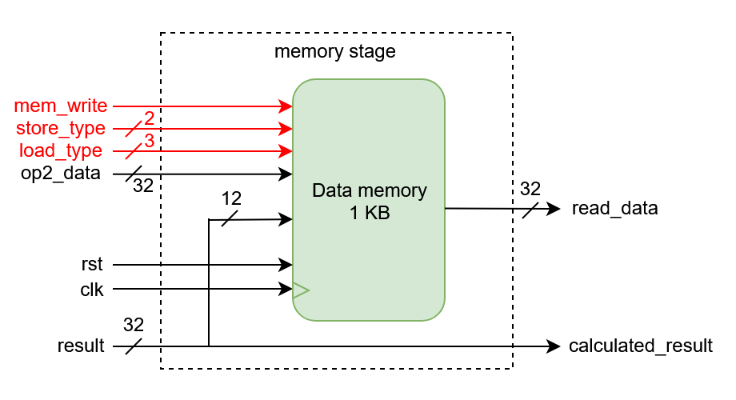
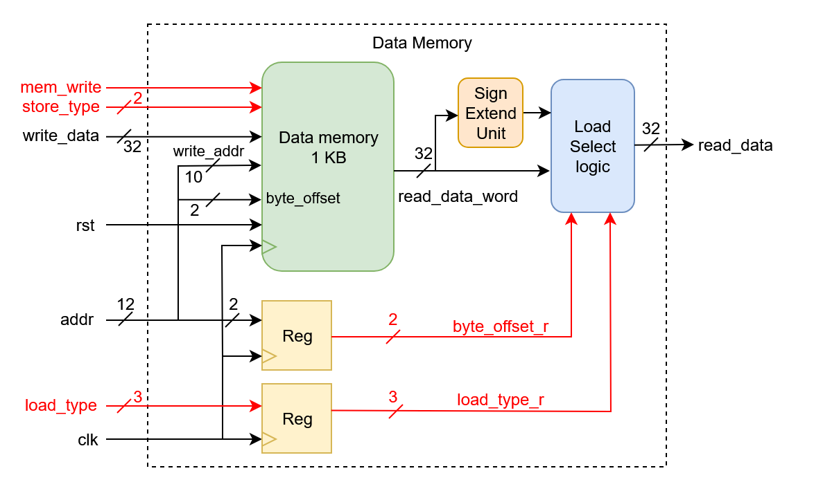

# Memory Stage Module

This folder contains the implementation of the **Memory (MEM) stage** for the RV32IM 5-stage pipelined processor.
The MEM stage handles **memory read/write operations** and passes the ALU result forward to the next stage.

## 📂 Folder Structure

* **mem_stage.v**
  RTL Verilog file implementing the MEM stage.

* **data_mem.v**
  Synchronous data memory module with support for byte, halfword, and word accesses.

* **README.md**
  This documentation file.

## 🚀 Features

* Handles **load** and **store** instructions with byte, halfword, and word granularity.
* Synchronous read and write operations using BRAM inference.
* Computes the value to forward to the Writeback stage.

## 📜 How It Works

### Ports

| Name                | Direction | Width | Description                              |
| ------------------- | --------- | ----- | ---------------------------------------- |
| `clk`               | input     | 1     | Clock signal                             |
| `rst`               | input     | 1     | Reset signal                             |
| `result`            | input     | 32    | ALU result / memory address              |
| `op2_data`          | input     | 32    | Data to store (for store instructions)   |
| `mem_write`         | input     | 1     | High to perform a write operation        |
| `store_type`        | input     | 2     | 00=SB, 01=SH, 10=SW                      |
| `load_type`         | input     | 3     | 000=LB, 001=LH, 010=LW, 011=LBU, 100=LHU |
| `read_data`         | output    | 32    | Data read from memory (to WB stage)      |
| `calculated_result` | output    | 32    | ALU result forwarded to WB stage         |

### Behavior

* **Memory Write:** Writes `op2_data` into memory according to `store_type` and address alignment.
* **Memory Read:** Reads data from memory, applies sign/zero extension based on `load_type`.
* **Forwarding:** ALU result is forwarded to the Writeback stage unmodified.

```verilog
assign calculated_result = result;
```

## 📊 Block Diagram - Memory Stage



---

* The memory logic is fully synchronous with **byte-enable support**, ensuring proper alignment and correct data width handling.



## 📌 Notes

* Fully synchronous design optimized for BRAM inference in Vivado.
* Compatible with 5-stage RV32IM pipeline.
* Supports byte/halfword/word loads and stores with proper sign/zero extension.

---

*Created by Talha Israr*
