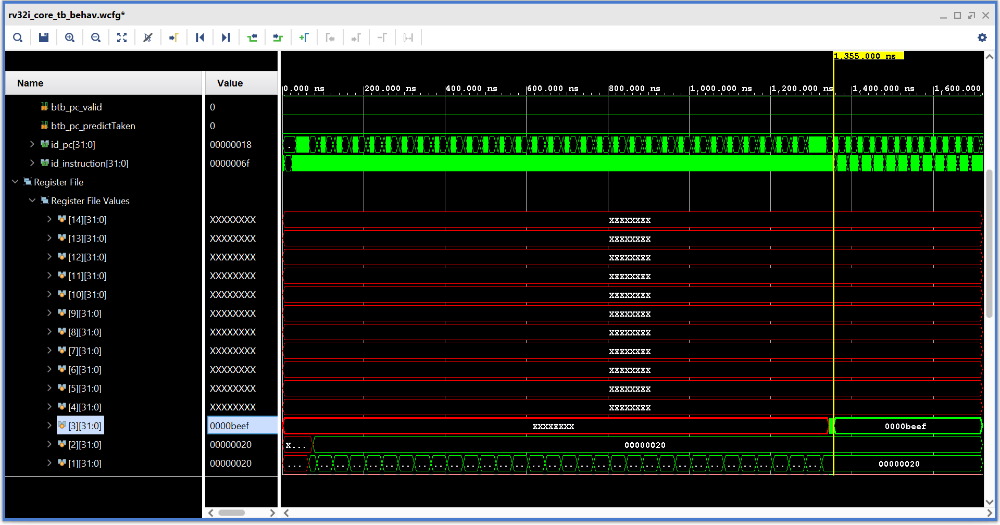
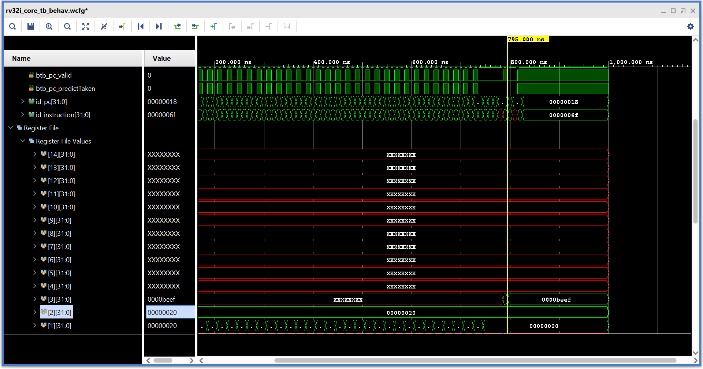

# Testbench (TB) Folder

This folder contains the **verification testbenches** for the RISC-V core design.  
The goal of these tests is to validate both functionality and performance under different workloads.

---

## 📂 Test Categories

### 1. Branch Target Buffer (BTB) Stress Tests
- Validates the **BTB correctness** under frequent taken/not-taken branches.
- A variety of tests for different workloads are compared and presented below. The tests can be found at [Branch Target Buffer tests](../programs/tests/btb/).
- The improvement from using the Branch Target Buffer (BTB) is calculated as:
$$
\text{Improvement (\%)} = \frac{\text{Cycles without BTB} - \text{Cycles with BTB}}{\text{Cycles without BTB}} \times 100
$$
- The total number of cycles in simulation can be calculated using:

$$
\text{Total Cycles} = \frac{\text{Time of last write to register file} - \text{Time when reset is released}}{\text{Simulation clock period}}
$$

Where:

* **Time of last write to register file** = the timestamp in your simulation when the last instruction writes back to the register file.
* **Time when reset is released** = the simulation time when reset is deasserted.
* **Simulation clock period** = the time period of your clock in the testbench (e.g., 10 ns).

| Test               | Without BTB (Cycles) | With BTB (Cycles) | Improvement |
| ------------------ | -------------------- |------------------ |------------ |
| Forward Branch     |         45           |        33         |    26.7 %   |
| Long Forward Branch|         133          |        77         |    42.1 %   |
| Conditional Branch |         86           |        60         |    30.2 %   |
| Nested Branch      |         147          |        103        |    29.9 %   |
| Alternating Branch |         165          |        129        |    21.8 %   |

One such result can be seen below. The following test is of Long Forward Branch.


After using the BTB we get the following results. The BTB is connected and dis-connected by changing the `update` signal in btb inst in top module to btb_update or 0.



### 2. Multiplication Tests
- Covers **shift-and-add multiply** (software) and **hardware MUL instructions**.

### 3. Forwarding and Hazard Tests

### 4. General ISA & Functional Tests

---

## Running Tests

To test different programs, use `programs/tests/` folder:

1. Copy or rename the desired test file into `programs/instructions.s`

   ```bash
   cp tests/alu_edgecases.s instructions.s
   ```
2. Rebuild:

   ```bash
   make clean
   make
   ```
3. Use the generated `instructions.hex` as your processor’s instruction memory.

4. Use the `rv32i_core_tb.sv` file for testbench and observe the results in the simulation waveform.

---

## 📌 Future Work

* Formal Verification using onespin and SVA
* UVM-based verification
* System Verilog automated testbenches

---

*Created by Talha Israr*
